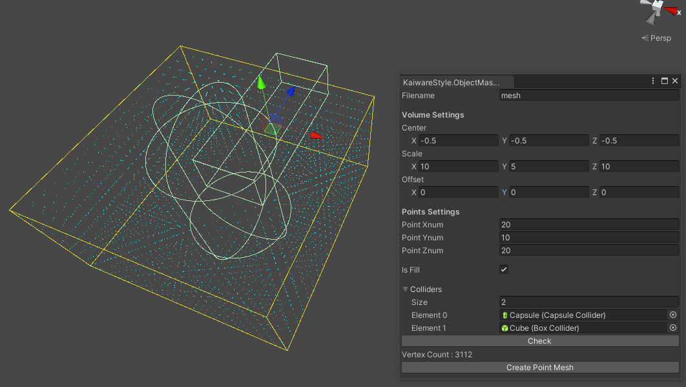

# ObjectMaskPointMeshMaker

## Summary
この拡張Editorは、MeshTopology.PointsのMeshファイル(.asset)を作成するツールです。
頂点を詰めるBoxのサイズと位置を指定できます。
Colliderの配列を渡すことで、Collider内に含まれる頂点を削除してMeshを作成する事もできます。

## Install
1. Unity 2019.4.3f1以降で新規のプロジェクトを作成してください
2. ObjectMaskPointMeshMaker.unitypackageをインポートしてください。

## Usage
MenuのCustom/Object Mask Point Mesh Makerを選択

